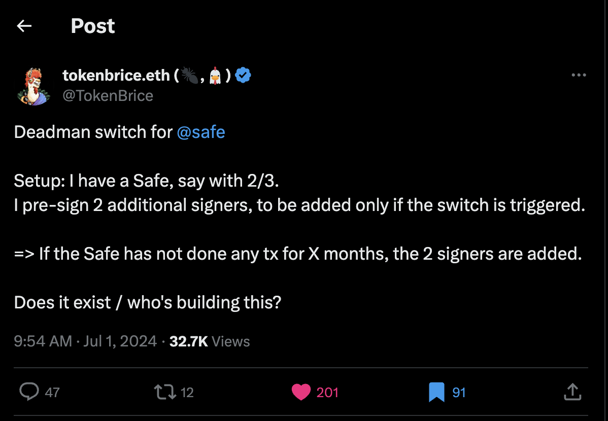

# deadman-safe(dms)
safe module that updates a safe's signers and threshold if the safe has being dormant(not active) for a period of time. dms uses [axiom](axiom.xyz) to safely check offchain when the safe's latest tx occured and triggers a deadman switch by updating the safe onchain based on the result.

## motivation
<div style="text-align:center"></div>

## installation

this repo contains both foundry and javascript packages. to install, run:

```bash
forge install
yarn install
```

## test

to run foundry tests that simulate the axiom integration flow, run

```bash
forge test -vvvv
```

## cli cheatsheet

```bash
# compile
npx axiom circuit compile app/axiom/average.circuit.ts --provider $PROVIDER_URI_11155111

# prove
npx axiom circuit prove app/axiom/average.circuit.ts --sourceChainId 11155111 --provider $PROVIDER_URI_11155111

# get parameters to send a query to axiom using sendQuery
npx axiom circuit query-params <callback contract address> --refundAddress <your Sepolia wallet address> --sourceChainId 11155111 --provider $PROVIDER_URI_11155111
```
## Disclaimer

_These smart contracts are being provided as is. No guarantee, representation or warranty is being made, express or implied, as to the safety or correctness of the user interface or the smart contracts. They have not been audited and as such there can be no assurance they will work as intended, and users may experience delays, failures, errors, omissions, loss of transmitted information or loss of funds. The creators are not liable for any of the foregoing. Users should proceed with caution and use at their own risk._